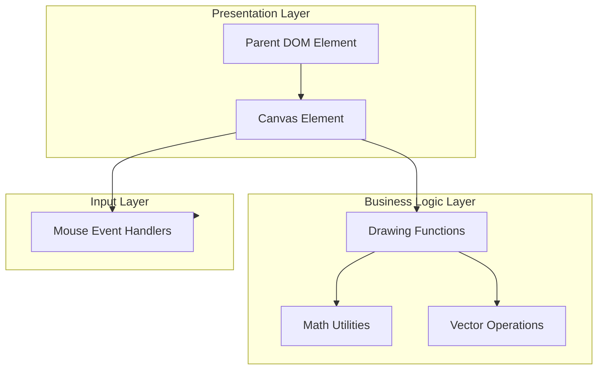
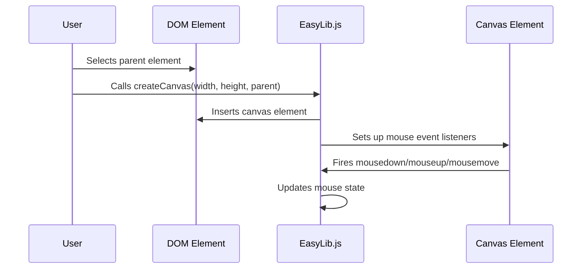
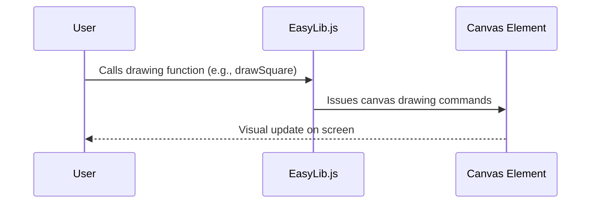

# EasyLib.js Feature Documentation

## Overview

**EasyLib.js** is a lightweight JavaScript graphics and math utility library designed to help people start programming, especially in creative coding and interactive graphics. It offers an approachable API for drawing shapes, handling mouse events, managing animation timing, and performing vector mathematics in the browser. The library abstracts away much of the HTML5 Canvas boilerplate, enabling beginners to focus on learning programming concepts and creative expression.

EasyLib.js is suitable for educational settings, tutorials, and quick prototyping. It defines a series of global helper functions and classes, making it possible to create interactive visual programs with minimal setup.

---

## Architecture Overview

The architecture of EasyLib.js revolves around the browser's canvas, event handling, and utility functions. The flowchart below summarizes the relationships between the core components:



---

## Component Structure

### 1. Presentation Layer

#### **Canvas Setup** (`global context`)
- **Purpose:** Initializes the drawing surface and context for rendering.
- **Key Properties:**
  - `canvas`: The main HTMLCanvasElement, globally accessible.
  - `ctx`: The 2D rendering context for `canvas`.
  - `canvasWidth`, `canvasHeight`: Dimensions of the canvas.
- **Key Methods:**
  - `createCanvas(width, height, parent)`: Creates and attaches a canvas element to a parent DOM node.

#### **Usage Example:**
```js
createCanvas(640, 480, document.getElementById('myContainer'));
```
This will insert a 640x480 canvas into the target element.

---

### 2. Drawing Functions

EasyLib.js provides functions for basic shapes and custom paths.

| Function                | Description                                                        | Parameters (Types)                                  | Returns      |
|-------------------------|--------------------------------------------------------------------|-----------------------------------------------------|--------------|
| `fillBackground(color)` | Fills the entire canvas with a solid color                         | `color: [r,g,b,a]` (array of 4 numbers)             | `void`       |
| `drawSquare(x, y, w, h, border, fill)` | Draws a rectangle at (x, y) with width and height     | `x, y, w, h`: number; `border, fill`: [r,g,b,a]     | `void`       |
| `drawCircle(x, y, r, border, fill)`    | Draws a circle at (x, y) with radius `r`             | `x, y, r`: number; `border, fill`: [r,g,b,a]        | `void`       |
| `drawLine(x1, y1, x2, y2, border)`     | Draws a line from (x1, y1) to (x2, y2)               | `x1, y1, x2, y2`: number; `border`: [r,g,b,a]       | `void`       |
| `startShape()`          | Begins a custom path                                               | none                                                | `void`       |
| `addCustomPoint(x, y)`  | Adds a point to the custom path                                    | `x, y`: number                                      | `void`       |
| `endShape(fill, border)`| Strokes/fills the custom path with specified colors                | `fill, border`: [r,g,b,a]                           | `void`       |

#### Color Format
- Colors are specified as arrays: `[red, green, blue, alpha]` (all 0-255 except alpha: 0-1).

---

### 3. Input Layer

Handles mouse interaction and state tracking.

| Variable/Function      | Description                                   | Type           |
|-----------------------|-----------------------------------------------|----------------|
| `mouse`               | Object: `{ x, y, pressed }`                   | `{x:number, y:number, pressed:boolean}` |
| `press`               | Indicates if the mouse button is pressed      | `boolean`      |
| `mouseX`, `mouseY`    | Mouse coordinates                             | `number`       |
| `mouseMove(e)`        | Updates mouse coordinates from event          | `function`     |
| `updateMouse(e)`      | Updates `mouse` object, called on events      | `function`     |

Mouse state is updated automatically via event listeners on the canvas.

---

### 4. Math Utilities

Essential random and mapping helpers.

| Function                | Description                                             | Parameters                                    | Returns   |
|-------------------------|--------------------------------------------------------|-----------------------------------------------|-----------|
| `random(min, max, decimal)` | Returns a random number in [min, max) (optionally fixed decimals) | `min: number, max?: number, decimal?: number` | `number` or `string` |
| `map(variable, floor, ceiling, min, max)` | Linearly maps a variable from one range to another | `variable, floor, ceiling, min, max`: number  | `number`  |
| `round(num)`            | Returns the nearest integer to `num`                   | `num: number`                                 | `number`  |
| `limitDecimal(num, decimal)` | Returns a string of `num` rounded to given decimals| `num: number, decimal: number`                | `string`  |

---

### 5. Vector Operations

#### **Vector Class**

Represents a 2D vector and supports common vector math for creative coding.

| Method           | Description                                   | Parameters (Types)      | Returns   |
|------------------|-----------------------------------------------|-------------------------|-----------|
| `constructor(x, y)` | Creates a new vector                       | `x: number, y: number`  | `Vector`  |
| `update()`       | Updates the internal array representation     | none                    | `void`    |
| `add(x, y)`      | Adds scalars to the vector                    | `x: number, y: number`  | `void`    |
| `sub(x, y)`      | Subtracts scalars from the vector             | `x: number, y: number`  | `void`    |
| `mult(x, y)`     | Multiplies vector by scalars                  | `x: number, y: number`  | `void`    |
| `div(x, y)`      | Divides vector by scalars                     | `x: number, y: number`  | `void`    |
| `addVec(vector)` | Adds another vector                           | `vector: Vector`        | `void`    |
| `subVec(vector)` | Subtracts another vector                      | `vector: Vector`        | `void`    |
| `multVec(vector)`| Multiplies by another vector                  | `vector: Vector`        | `void`    |
| `divVec(vector)` | Divides by another vector                     | `vector: Vector`        | `void`    |
| `magnitude()`    | Returns the magnitude of the vector           | none                    | `number`  |
| `normalize()`    | Normalizes the vector to length 1             | none                    | `void`    |
| `distance(vector)`| Returns distance to another vector           | `vector: Vector`        | `number`  |
| `dot(vector)`    | Returns dot product with another vector       | `vector: Vector`        | `number`  |
| `angle(vector)`  | Returns angle to another vector (radians)     | `vector: Vector`        | `number`  |

**Helper Function:**
```js
vector(x, y) // returns a new Vector(x, y)
```

---

### 6. Timing and Animation

| Variable/Function     | Description                                        | Type            |
|----------------------|----------------------------------------------------|-----------------|
| `interval`           | Milliseconds between frames (default: 1000/30)     | `number`        |
| `intervalID`         | ID of the current setInterval                      | `number`        |
| `setFPS(fps)`        | Changes the frame rate for the main loop           | `function`      |
| `sleepFor(ms)`       | Returns a promise that resolves after ms milliseconds | `Promise<void>`|
| `window.onload`      | Calls `onload()` when window loads (assumes user-defined `onload`) | `void`    |

A main animation loop is maintained using `setInterval(main, interval)`. The user must define a `main` function as the animation loop.

---

## Feature Flows

### 1. Canvas Initialization and Mouse Input



### 2. Drawing a Shape



---

## State Management

**UI States in EasyLib.js:**
- There is no internal state management framework, but the library enables tracking of:
    - Mouse pressed state (`mouse.pressed`)
    - Mouse coordinates (`mouse.x`, `mouse.y`)
    - Animation timing via manual or automatic intervals

---

## Integration Points

- **HTML DOM:** Integrates directly with the DOM, requiring a parent node for the canvas.
- **User-Defined Functions:** Expects the user to define `main()` for the animation loop and `onload()` for initialization.
- **Global Namespace:** Attaches many helpers to the `globalThis` object.

---

## Key Classes Reference

| Class   | Location       | Responsibility                  |
|---------|----------------|---------------------------------|
| `Vector`| `easyLib.js`   | 2D vector mathematics           |

| Function        | Location       | Responsibility                    |
|-----------------|---------------|-----------------------------------|
| `createCanvas`  | `easyLib.js`  | Sets up drawing surface           |
| `fillBackground`| `easyLib.js`  | Fills the canvas with color       |
| `drawSquare`    | `easyLib.js`  | Draws a rectangle                 |
| `drawCircle`    | `easyLib.js`  | Draws a circle                    |
| `drawLine`      | `easyLib.js`  | Draws a line                      |
| `random`        | `easyLib.js`  | Generates random numbers          |
| `map`           | `easyLib.js`  | Remaps a value between ranges     |
| `round`         | `easyLib.js`  | Rounds a number                   |
| `limitDecimal`  | `easyLib.js`  | Limits number to fixed decimals   |
| `mouseMove`     | `easyLib.js`  | Updates mouse position            |
| `updateMouse`   | `easyLib.js`  | Updates mouse state object        |
| `setFPS`        | `easyLib.js`  | Changes main loop frame rate      |
| `sleepFor`      | `easyLib.js`  | Delays execution asynchronously   |

---

## Error Handling

- The library does not contain explicit error handling or exceptions.
- If invalid parameters are provided (e.g., non-existent parent in `createCanvas`), JavaScript runtime errors may occur.
- All methods assume correct usage and do not validate input types or ranges.

---

## Caching Strategy

- There is no caching or memoization implemented in EasyLib.js.

---

## Dependencies

- No external dependencies.
- Relies on browser support for HTML5 Canvas and standard JavaScript.

---

## Testing Considerations

**Key scenarios to test:**
- Canvas creation with various sizes and parent elements.
- Drawing functions with different color and shape parameters.
- Mouse input tracking during drawing and animation loops.
- Vector operations for accuracy (addition, subtraction, magnitude, etc.).
- Animation loop timing and FPS changes.
- Random number generation and number formatting utilities.

---

# License

```
MIT License

Copyright (c) 2026 António Fonseca

Permission is hereby granted, free of charge, to any person obtaining a copy
of this software and associated documentation files (the "Software"), to deal
in the Software without restriction, including without limitation the rights
to use, copy, modify, merge, publish, distribute, sublicense, and/or sell
copies of the Software, and to permit persons to whom the Software is
furnished to do so, subject to the following conditions:

The above copyright notice and this permission notice shall be included in all
copies or substantial portions of the Software.

THE SOFTWARE IS PROVIDED "AS IS", WITHOUT WARRANTY OF ANY KIND, EXPRESS OR
IMPLIED, INCLUDING BUT NOT LIMITED TO THE WARRANTIES OF MERCHANTABILITY,
FITNESS FOR A PARTICULAR PURPOSE AND NONINFRINGEMENT. IN NO EVENT SHALL THE
AUTHORS OR COPYRIGHT HOLDERS BE LIABLE FOR ANY CLAIM, DAMAGES OR OTHER
LIABILITY, WHETHER IN AN ACTION OF CONTRACT, TORT OR OTHERWISE, ARISING FROM,
OUT OF OR IN CONNECTION WITH THE SOFTWARE OR THE USE OR OTHER DEALINGS IN THE
SOFTWARE.
```